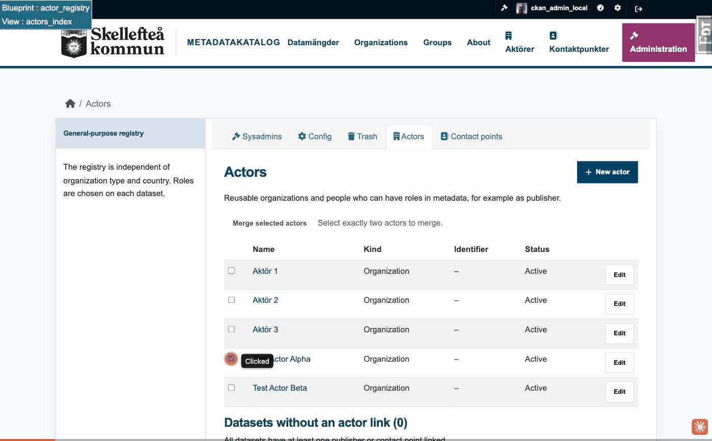

# ckanext-actor-registry

Reusable publishers and contact points for CKAN metadata.

> **Status: 0.2.1 alpha.** This version is intended for evaluation and feedback.
> It has an automated test suite that runs against CKAN 2.11 and CKAN 2.12. The
> user interface is in English by default, with a Swedish translation catalog
> following the installation's locale settings. Do not treat it as
> production-ready without your own review and tests.

## Documentation

- **[Installation and supported versions](docs/INSTALLATION.md)**: which CKAN and
  ckanext-scheming versions are tested, configuration, the database migration and the
  pitfalls to avoid;
- **[Run it with Docker Compose](examples/ckan-2.12/README.md)**: a complete example (CKAN
  2.11 or 2.12, PostgreSQL, Solr, Redis) with a smoke test, for trying the extension or as
  a starting point;
- [Changelog](CHANGELOG.md) and [release notes](docs/RELEASE_NOTES_0.2.0.md);
- [Testing](TESTING.md): how to run the automated suite on each supported CKAN version;
- [RDF and interoperability](docs/RDF_AND_INTEROPERABILITY.md): the optional DCAT-AP profile;
- [Translations](docs/TRANSLATIONS.md): how the English and Swedish catalogues are maintained;
- [Contributing](CONTRIBUTING.md), [security policy](SECURITY.md) and
  [AI assistance disclosure](AI_ASSISTANCE.md).

## Why this extension exists

CKAN datasets often repeat publisher and contact details. Repetition is easy to
introduce but expensive to maintain: a changed email address or organization
name must be corrected on every affected dataset.

This extension stores publishers and contact points once and lets datasets
reference them by stable internal IDs. Registry changes are resolved when a
dataset is displayed or exported, so one central update can be reflected
wherever the record is used. This isn't just a convenience: DCAT-AP itself
expects a dataset's publisher and contact point to be addressable entities in
their own right, not text -- see "Data model and DCAT-AP mapping" below for how
the registry implements that.

A **publisher** is an organization or a person that publishes datasets. A
**contact point** is a reusable contact function; it can belong to an
organization (a publisher) but doesn't have to. Neither concept replaces a CKAN
organization: CKAN organizations continue to control dataset ownership and
permissions.

> **Terminology.** In the interface these records are called *publishers*. The
> word *actor* survives only in technical places: the URLs (`/actors`), the
> dataset field `publisher_actor_id`, the Python package and the action names
> (`actor_registry_*`).

## Publishers vs. CKAN organizations

CKAN already has an "Organization" concept, so it's fair to ask why this
extension adds new records instead of extending it.

A CKAN organization is primarily an access-control and ownership unit: every
dataset belongs to exactly one organization, and membership in it determines
who may create, edit or delete the dataset. That's a different question from
who publishes a dataset or who to contact about it. The two often coincide in
practice, but not always: a dataset can be maintained by editors who aren't
themselves the responsible publisher, a single dataset commonly needs more
than one contact point (technical, legal, general enquiries) where an
organization has only the one dataset-to-organization relationship, a publisher
can be a person rather than an organization at all, and the same publisher can
publish datasets that live under different owner organizations on the same
catalog -- none of which map cleanly onto extending the organization model.

Extending CKAN's organization type to carry this metadata would also mean
changing a core concept that already governs permissions, for a purely
descriptive need. Publishers and contact points are deliberately independent
instead: additive tables with no CKAN user account, group membership or
permission of their own, and no effect on how organizations already control
dataset ownership.

## Features

- central registries for publishers and contact points;
- stable URIs, identifiers (unique per identifier scheme) and optional
  controlled publisher types;
- active/inactive records without breaking existing references; merging of
  duplicates and, for sysadmins, permanent deletion;
- alphabetical selectors with previews;
- inline creation and editing while editing a dataset, available to any
  logged-in editor;
- the current user's last publisher preselected on a new dataset;
- the current user's three most recently used contact points shown first;
- readable display on the dataset page (name and contact details, never internal
  IDs), and a page per publisher and contact point that lists its datasets;
- a worklist of datasets that are missing a publisher and/or a contact point;
- one shared validation layer (lengths, email, web addresses, URIs, phone
  numbers) and opt-in validators that keep datasets from pointing at records that
  no longer exist;
- Scheming helpers, form and display snippets, and a localised example schema;
- an English interface with Swedish (`sv`, `sv_SE`) translations;
- optional DCAT integration: publishers become `foaf:Agent` values and contact
  points become `vcard:Kind` values;
- optional `vcard:hasTelephone` serialization for the European DCAT-AP 3
  profile used by DCAT-AP-SE implementations;
- validation that prevents a publisher and a contact point from sharing the same
  RDF URI.

## Data model and DCAT-AP mapping

None of this matters if you don't use DCAT: the RDF profile is entirely
opt-in (enabled only by setting `ckanext.dcat.rdf.profiles =
actor_registry_euro_dcat_ap_3` after installing ckanext-dcat). Without it,
publishers and contact points work exactly like a plain metadata-management
feature -- centrally maintained records, picked from a dropdown, editable in
place -- and you never need to think about `foaf:Agent` or `vcard:Kind`. The
rest of this section only matters once RDF/DCAT-AP export enters the
picture.

DCAT-AP does not treat a dataset's publisher or contact point as free text:
`dct:publisher` is expected to be a `foaf:Agent` with its own identity, and
`dcat:contactPoint` a `vcard:Kind` -- both addressable, reusable entities, not
strings duplicated on every dataset. This extension's registry gives CKAN
real, database-backed records with stable URIs for exactly that purpose;
`publisher_actor_id` / `contact_point_ids` on the dataset are resolved into
the `foaf:Agent` / `vcard:Kind` RDF shape only when a dataset is serialized
for DCAT export -- nothing is duplicated onto the dataset itself.

A publisher's `Kind` (Organization or Person) determines the specific agent
type used on export. A contact point's phone number is additionally serialized
as a `vcard:hasTelephone` / `vcard:Voice` node carrying a `tel:` URI, matching
what the DCAT-AP-SE profile expects rather than ckanext-dcat's own default
handling of phone numbers. The extension builds on ckanext-dcat's
`EuropeanDCATAP3Profile`, so a DCAT-AP 3 consumer gets correctly typed,
dereferenceable publisher and contact point data without extra configuration.

## Screenshots

Everything below follows from one idea: publishers and contact points are
maintained once, centrally, instead of being retyped on every dataset -- which
is manageable for a handful of datasets and increasingly unmanageable as a
catalog grows.

> **The screenshots are being retaken for 0.2.0.** Each image link below is
> marked; the images will be added in a later commit.

### Publishers: organizations and people

A publisher can represent either an organization or a person -- the `Kind` field
is the only difference, and everything else in the registry (the dataset
pickers, the quick-create widget, merging) treats both the same way. An
identifier and its scheme (for example `SE:ORGNR`) are optional but must be
given together, and the pair is unique among active publishers: a clash names
the existing publisher instead of failing with a generic error.


*(Screenshot to be added later.)*


*(Screenshot to be added later.)*

### Contact points

Contact points are a separate, parallel register. A contact point can optionally
belong to an organization ("Belongs to organization"), but doesn't have to -- a
shared mailbox or a role-based contact works just as well as a named person.


*(Screenshot to be added later.)*

### Linking a dataset to the registry

When editing a dataset, the publisher (a single publisher) and one or more
contact points are chosen from the same registry used everywhere else in CKAN:


*(Screenshot to be added later.)*

If the publisher or contact point you need doesn't exist yet, either can be
created without leaving the dataset form. And if one already exists but needs a
correction, it can be edited from right here too -- the change applies
everywhere it is used, not just on this dataset:


*(Screenshot to be added later.)*

### What visitors see

On the public dataset page the publisher and each contact point are shown with
their readable details -- name, web address, email and so on, one per line --
never internal IDs. A publisher that has been merged into another shows as the
surviving publisher; inactive or missing records are simply left out.


*(Screenshot to be added later.)*

Publisher and contact point pages list the datasets they are linked to: the
first ten, with the total and a "Show all" link to a paginated list. The lists
respect dataset visibility, so private datasets are only shown to people who may
see them.


*(Screenshot to be added later.)*

### Merging two publishers

Merging two duplicate publishers -- select exactly two, choose which value wins
per field, confirm, and the publisher that isn't kept is soft-retired and points
to the remaining record. Datasets that pointed to the retired publisher are
re-pointed automatically, so the surviving publisher's dataset count grows to
reflect the merge:


*(Screenshot to be added later.)*

Soft-retiring rather than deleting exists for one reason: a merged publisher's
web address (its URI) may already be linked to, or cached, outside this
catalogue -- in a harvested copy, an external DCAT graph, a bookmark. A retired
publisher's own page keeps responding and points at the record it was merged
into, instead of going dead. Retired publishers are hidden from `/actors` by
default so the list stays focused on what's still in use, with a checkbox to
show them again. From there, a sysadmin can also permanently delete one --
useful for cleaning up test data or duplicates that were never referenced
outside this catalogue -- but doing so gives up that permanent-address
guarantee for good, which is why the extension asks for that decision
explicitly rather than doing it automatically after a merge.

### A dataset with no publisher set

A newly created dataset with neither a publisher nor a contact point shows an
inline warning on its own page, with pickers for both fields. This is also
exactly what an editor sees, dataset by dataset, right after the extension is
activated on a catalog that already has data -- see "Activating on an existing
installation with datasets" below for the full picture, including the separate
worklist view:


*(Screenshot to be added later.)*

The same dataset also shows up on the registry's own worklist, so it can be
found and fixed from either place:


*(Screenshot to be added later.)*

Saving resolves the warning immediately, without leaving the page:


*(Screenshot to be added later.)*

## Requirements and compatibility

- CKAN 2.11.1 or later 2.11 releases, or CKAN 2.12; the full automated suite (including
  the official DCAT-AP 3 SHACL validation) runs on all of them;
- PostgreSQL, as required by CKAN;
- `ckanext-scheming` for the included dataset form widgets; 3.1.0 is
  recommended (see [docs/INSTALLATION.md](docs/INSTALLATION.md) for the versions that
  are tested and a known deprecation warning on CKAN 2.12);
- `ckanext-dcat` and RDFLib only when the optional RDF profile is enabled.

CKAN 2.11.0 and 2.10 and older are not supported (2.11.0 could not be tested: its official
image has no working pytest plugin).

## Installation

The quickest way to try the extension is the [Docker Compose example](examples/ckan-2.12/README.md).
For an existing CKAN, follow [docs/INSTALLATION.md](docs/INSTALLATION.md); in short, install
the source checkout in the same Python environment as CKAN:

```console
cd /path/to/ckanext-actor-registry
pip install -e .
```

Add `actor_registry` to `ckan.plugins`:

```ini
ckan.plugins = ... actor_registry
```

Create or upgrade the extension's database tables:

```console
ckan -c /etc/ckan/default/ckan.ini db upgrade -p actor_registry
```

Restart CKAN. Logged-in users can then manage publishers at `/actors` and contact
points at `/contactpoints`.

## Scheming integration

The extension supplies choice helpers, two form snippets, two display snippets and
two optional validators. A minimal schema configuration is:

```yaml
- field_name: publisher_actor_id
  label: Publisher
  preset: select
  required: true
  form_snippet: actors_multiple_select.html
  display_snippet: actor.html
  choices_helper: actors_choices
  sorted_choices: true
  validators: scheming_required actor_registry_actor_exists

- field_name: contact_point_ids
  label: Contact points
  preset: multiple_select
  form_snippet: contactpoints_multiple_select.html
  display_snippet: contactpoints.html
  choices_helper: contactpoints_choices
  sorted_choices: true
  validators: ignore_missing scheming_multiple_choice actor_registry_contactpoints_exist
```

A complete, localised (`en`, `sv`, `sv_SE`) example schema ships with the extension
and is used by the tests: `ckanext.actor_registry.examples:actor_registry_schema.yaml`.
It is an integration example, not a universal metadata schema.

The field names shown above are part of the 0.x data contract. Datasets store
registry UUIDs in these fields (`publisher_actor_id` as a string,
`contact_point_ids` as a list). The display snippets resolve them to readable
details on the dataset page. For RDF export the profile resolves them into the
`publisher` and `contact` shapes that the Scheming profiles in `ckanext-dcat`
expect, at serialization time only; nothing extra is written onto the dataset.
The two `actor_registry_*_exist` validators are opt-in: they make a dataset
refuse a reference to a record that does not exist or is no longer active.

## Optional DCAT profile

The core registry is independent of DCAT, country and organization type. For
RDF export with telephone support, enable the profile entry point after
installing `ckanext-dcat`:

```ini
ckanext.dcat.rdf.profiles = actor_registry_euro_dcat_ap_3
```

The profile subclasses `EuropeanDCATAP3Profile`. It delegates normal publisher
and contact serialization to `ckanext-dcat` and adds telephone values as
`vcard:hasTelephone` / `vcard:Voice` / `vcard:hasValue` with a `tel:` URI.
Theme and publisher-type URIs are also typed as `skos:Concept` so standalone
DCAT-AP 3 validation can identify their intended range. Store publisher types
as controlled-vocabulary URIs rather than local display labels.
This is an interoperability aid, not a claim that installing this extension
alone makes a catalog conformant with DCAT-AP or DCAT-AP-SE. Conformance also
depends on the complete dataset schema, validation and profile configuration.

## Access control and data handling

- registry list and edit pages, and inline publisher/contact creation, are
  available to any logged-in CKAN user, not just sysadmins -- the registry
  holds shared, catalog-wide data meant for editors generally;
- merging two publishers is the one exception and stays restricted to CKAN
  sysadmins, since it is destructive and re-points datasets across the
  whole catalog rather than just the acting user's own organization;
- deployments must set `ckan.csrf_protection.ignore_extensions = false` so
  CKAN validates the CSRF tokens included by the management and inline forms;
- individual publisher and contact point display pages are readable wherever
  the CKAN site itself permits access;
- input is validated on the server by one shared layer, for the forms, the inline
  dialogs and the merge action alike: length limits that match the database
  columns, email addresses (checked with CKAN's own validator), web addresses,
  URIs and phone numbers. Stored web addresses and URIs are only rendered as
  links when CKAN's `h.is_url` accepts them; anything else is shown as plain text;
- per-user convenience data stores only CKAN user IDs, the most recent
  publisher ID and recently used contact point IDs;
- the dataset lists on a publisher's or contact point's page, on their "Show all"
  pages and in the `/actors` worklist only include private datasets that the
  visitor may see: sysadmins, and members of the dataset's organization. The
  totals shown follow the same rule, so a private dataset is never revealed by
  a count. FYI: a user who was given access to a single private dataset through
  CKAN's *dataset collaborators* feature (`ckan.auth.allow_dataset_collaborators`,
  off by default) but is not a member of its organization does not see that
  dataset in these lists; the dataset itself can still be opened directly;
- a publisher can also be permanently deleted (`/actors/<id>/delete`), sysadmin-
  only like merging. Datasets that had it as publisher have that field
  cleared; contact points it owned become standalone rather than being
  deleted themselves. This is a real delete, not a soft-retire -- see
  "Merging two publishers" above for why that distinction matters;
- a contact point can likewise be permanently deleted
  (`/contactpoints/<id>/delete`), sysadmin-only. It is removed from the
  `contact_point_ids` of any dataset that listed it (other contact points
  on the same dataset are left alone); an owning publisher, if any, is
  unaffected.

## Activating on an existing installation with datasets

Enabling this extension on a CKAN instance that already has datasets does not
retroactively link anything: every existing dataset starts out with no
publisher and no contact point in the registry, because those are new,
separate fields the extension adds via Scheming (see "Scheming integration"
above). Two features exist specifically to help you find and fix these
datasets afterwards; neither runs automatically, so plan to use them as a
one-time cleanup pass after activation.

**A worklist on `/actors`.** The registry management page (*Publishers*) lists
the active datasets that are missing something, with a direct link to each one.
By default it shows the datasets missing *both* a publisher *and* any contact
point ("Datasets missing both a publisher and a contact point (N)"), which
surfaces the datasets nobody has touched yet. The *Missing:* buttons above the
list widen or change that: *Publisher* (every dataset without a publisher),
*Contact point* (every dataset without a contact point) or *Either* (missing at
least one of the two). The page shows the first ten with the total and a "Show
all" link to a paginated list, and private datasets only appear for people who
may see them.

**An inline fix on the dataset's own page.** Opening any dataset that is
missing a publisher and/or a contact point shows a warning box near the top
of the page with the same selector widgets (including "create new...") used
in the full dataset edit form, so editors recognize the control instead of
having to find the right field inside the advanced edit view. Saving it
performs a partial update -- only the field(s) you actually filled in are
touched, the rest of the dataset is left alone -- and requires the normal
`package_update` permission for that dataset, not sysadmin. This prompt
appears when either field is empty, like the worklist's *Either* choice.

Both features rely on `ckanext-scheming`'s own `read.html` template chain, so
they only appear for dataset types managed by Scheming.

## Upgrade note for the prototype

The migration history retains the table name
`contactpoints_alembic_version`. This is intentional so installations upgraded
from the earlier, unpublished `ckanext-contactpoints` prototype preserve their
existing data. New installations should use only the `actor_registry` plugin
and migration command.

Upgrading from the 0.1.0 source snapshot? See the "Upgrading" section of the
[0.2.0 release notes](docs/RELEASE_NOTES_0.2.0.md): run the migration, and note that the
translation keys changed with the UI wording.

## Known limitations

- no Action API is provided for registry administration;
- there is no import/export command for registry data;
- browser-based (end-to-end) tests and a formal security review are still
  pending;
- selection and validation of identifier schemes and publisher-type
  vocabularies is left to the deploying catalog;
- the dataset lists on publisher and contact point pages do not include private
  datasets that a user can only see as a *dataset collaborator* (see "Access
  control and data handling").

See [CHANGELOG.md](CHANGELOG.md) for release contents and
[CONTRIBUTING.md](CONTRIBUTING.md) for how to help. Please report security
issues according to [SECURITY.md](SECURITY.md).

The automated and manual test strategy is documented in
[TESTING.md](TESTING.md).

## Development transparency

The implementation and documentation were developed by Björn Hagström with
assistance from OpenAI's ChatGPT and Codex and, from version 0.2.0, from
Anthropic's Claude Code. The human maintainer directs, reviews and accepts
responsibility for the released work, including its correctness, security,
licensing and provenance. See [AI_ASSISTANCE.md](AI_ASSISTANCE.md).

## License

MIT. See [LICENSE](LICENSE).
