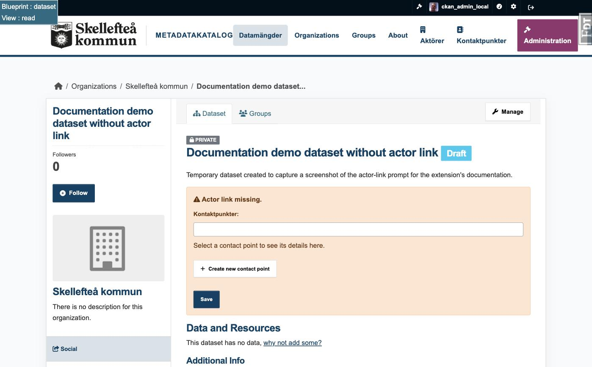
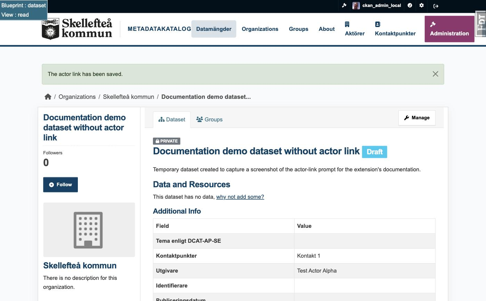

# ckanext-actor-registry

Reusable actors and contact points for CKAN metadata.

> **Status: 0.1.0 alpha.** This first public version is intended for evaluation
> and feedback. It has been tested manually with CKAN 2.11.6 and now includes an
> initial automated test suite. The user interface is in English by default, with
> a Swedish translation catalog following the installation's locale settings.
> Do not treat it as production-ready without your own review and tests.

## Why this extension exists

CKAN datasets often repeat publisher and contact details. Repetition is easy to
introduce but expensive to maintain: a changed email address or organization
name must be corrected on every affected dataset.

This extension stores actors and contact points once and lets datasets reference
them by stable internal IDs. Registry changes are resolved when a dataset is
displayed or exported, so one central update can be reflected wherever the
record is used.

An **actor** is an organization or person that may fulfil a metadata role, such
as publisher. A **contact point** is a reusable contact function and may be
linked to an actor. Neither concept replaces a CKAN organization: CKAN
organizations continue to control dataset ownership and permissions.

## Features in 0.1.0

- central registries for actors and contact points;
- stable URIs, identifiers and optional controlled actor types;
- active/inactive records without breaking existing references;
- alphabetical selectors with contact previews;
- inline creation while editing a dataset, restricted to CKAN sysadmins;
- the current user's last publisher preselected on a new dataset;
- the current user's three most recently used contact points shown first;
- Scheming helpers and form snippets for dataset schemas;
- optional DCAT integration: publishers become `foaf:Agent` values and contact
  points become `vcard:Kind` values;
- optional `vcard:hasTelephone` serialization for the European DCAT-AP 3
  profile used by DCAT-AP-SE implementations.
- validation that prevents an actor and a contact point from sharing the same
  RDF URI.

## Screenshots

Merging two duplicate actors -- select exactly two, choose which value wins
per field, confirm, and the actor that isn't kept is soft-retired and points
to the remaining record:


The inline prompt on a dataset's own page when it is missing a publisher
and/or a contact point (here: publisher already set, contact point missing),
using the same picker widgets as the full edit form:



Saving it resolves the warning immediately, without leaving the page:



## Requirements and compatibility

- CKAN 2.11; 0.1.0 has been manually tested on CKAN 2.11.6 only;
- PostgreSQL, as required by CKAN;
- `ckanext-scheming` for the included dataset form widgets;
- `ckanext-dcat` and RDFLib only when the optional RDF profile is enabled.

Compatibility with CKAN 2.10 and 2.12 has not yet been verified.

## Installation

Install the source checkout in the same Python environment as CKAN:

```console
cd /path/to/ckanext-actor-registry
pip install -e .
```

Add `actor_registry` to `ckan.plugins`:

```ini
ckan.plugins = ... actor_registry
```

Create or upgrade the extension's database tables:

```console
ckan -c /etc/ckan/default/ckan.ini db upgrade -p actor_registry
```

Restart CKAN. Sysadmins can then manage records at `/actors` and
`/contactpoints`.

## Scheming integration

The extension supplies choice helpers and two form snippets. A minimal schema
configuration is:

```yaml
- field_name: publisher_actor_id
  label: Publisher
  preset: select
  required: true
  form_snippet: actors_multiple_select.html
  choices_helper: actors_choices
  sorted_choices: true
  form_include_blank_choice: true

- field_name: contact_point_ids
  label: Contact points
  preset: multiple_select
  form_snippet: contactpoints_multiple_select.html
  choices_helper: contactpoints_choices
  sorted_choices: true
```

The field names shown above are part of the 0.1 data contract. Datasets store
registry UUIDs in these fields. The extension resolves them into `publisher`
and `contact` objects in `after_dataset_show`, which is the shape expected by
the Scheming profiles in `ckanext-dcat`.

## Optional DCAT profile

The core registry is independent of DCAT, country and organization type. For
RDF export with telephone support, enable the profile entry point after
installing `ckanext-dcat`:

```ini
ckanext.dcat.rdf.profiles = actor_registry_euro_dcat_ap_3
```

The profile subclasses `EuropeanDCATAP3Profile`. It delegates normal publisher
and contact serialization to `ckanext-dcat` and adds telephone values as
`vcard:hasTelephone` / `vcard:Voice` / `vcard:hasValue` with a `tel:` URI.
Theme and publisher-type URIs are also typed as `skos:Concept` so standalone
DCAT-AP 3 validation can identify their intended range. Store publisher types
as controlled-vocabulary URIs rather than local display labels.
This is an interoperability aid, not a claim that installing this extension
alone makes a catalog conformant with DCAT-AP or DCAT-AP-SE. Conformance also
depends on the complete dataset schema, validation and profile configuration.

## Access control and data handling

- registry list and edit pages are restricted to CKAN sysadmins;
- inline actor and contact creation is restricted to CKAN sysadmins;
- deployments must set `ckan.csrf_protection.ignore_extensions = false` so
  CKAN validates the CSRF tokens included by the management and inline forms;
- individual actor and contact display pages are readable wherever the CKAN
  site itself permits access;
- per-user convenience data stores only CKAN user IDs, the most recent
  publisher ID and recently used contact point IDs;
- deleting registry records is not exposed in 0.1.0; records can be made
  inactive instead.

## Activating on an existing installation with datasets

Enabling this extension on a CKAN instance that already has datasets does not
retroactively link anything: every existing dataset starts out with no
publisher and no contact point in the registry, because those are new,
separate fields the extension adds via Scheming (see "Scheming integration"
above). Two features exist specifically to help you find and fix these
datasets afterwards; neither runs automatically, so plan to use them as a
one-time cleanup pass after activation.

**A worklist on `/actors`.** The registry management page lists every active
dataset that has *neither* a publisher *nor* any contact point under
"Datasets without an actor link (N)", with a direct link to each one. A
dataset that has only one of the two set (for example a publisher but no
contact point) will not appear in this list -- it is meant to surface
datasets nobody has touched yet, not to enforce that every field is filled
in.

**An inline fix on the dataset's own page.** Opening any dataset that is
missing a publisher and/or a contact point shows a warning box near the top
of the page with the same selector widgets (including "create new...") used
in the full dataset edit form, so editors recognize the control instead of
having to find the right field inside the advanced edit view. Saving it
performs a partial update -- only the field(s) you actually filled in are
touched, the rest of the dataset is left alone -- and requires the normal
`package_update` permission for that dataset, not sysadmin. This prompt
reacts to either field being empty (so it can appear even for a dataset that
already has one of the two set), which is why its trigger condition is
looser than the `/actors` worklist above.

Both features rely on `ckanext-scheming`'s own `read.html` template chain, so
they only appear for dataset types managed by Scheming.

## Upgrade note for the prototype

The migration history retains the table name
`contactpoints_alembic_version`. This is intentional so installations upgraded
from the earlier, unpublished `ckanext-contactpoints` prototype preserve their
existing data. New installations should use only the `actor_registry` plugin
and migration command.

## Known limitations

- no Action API is provided for registry administration;
- only sysadmins can manage registry records;
- there is no import/export command for registry data;
- browser and multi-version compatibility tests plus formal security review
  are still pending;
- selection and validation of identifier schemes and publisher-type
  vocabularies is left to the deploying catalog.

See [CHANGELOG.md](CHANGELOG.md) for release contents and
[CONTRIBUTING.md](CONTRIBUTING.md) for how to help. Please report security
issues according to [SECURITY.md](SECURITY.md).

The automated and manual test strategy is documented in
[TESTING.md](TESTING.md).

## Development transparency

The initial implementation and documentation were developed by Björn Hagström
with assistance from OpenAI's ChatGPT and Codex. The human maintainer directs,
reviews and accepts responsibility for the released work, including its
correctness, security, licensing and provenance. See
[AI_ASSISTANCE.md](AI_ASSISTANCE.md).

## License

MIT. See [LICENSE](LICENSE).
